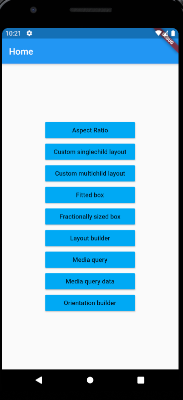

This project depicts the various topics of flutter that helps in building responsive and adaptive android and IOS UIs. 

The various widgets and classes used are given below 
1. Aspect Ratio  
2. Custom single child layout  
3. Custom multi child layout  
4. Fitted box  
5. Fractionally sized box  
6. Media Query  
7. Media Query data  
8. Orientation builder  

Below is the screenshot of the UI 

